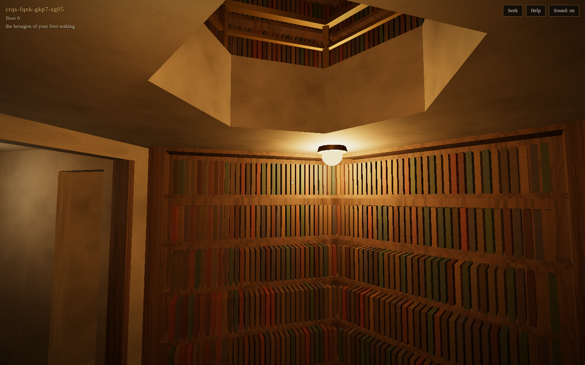
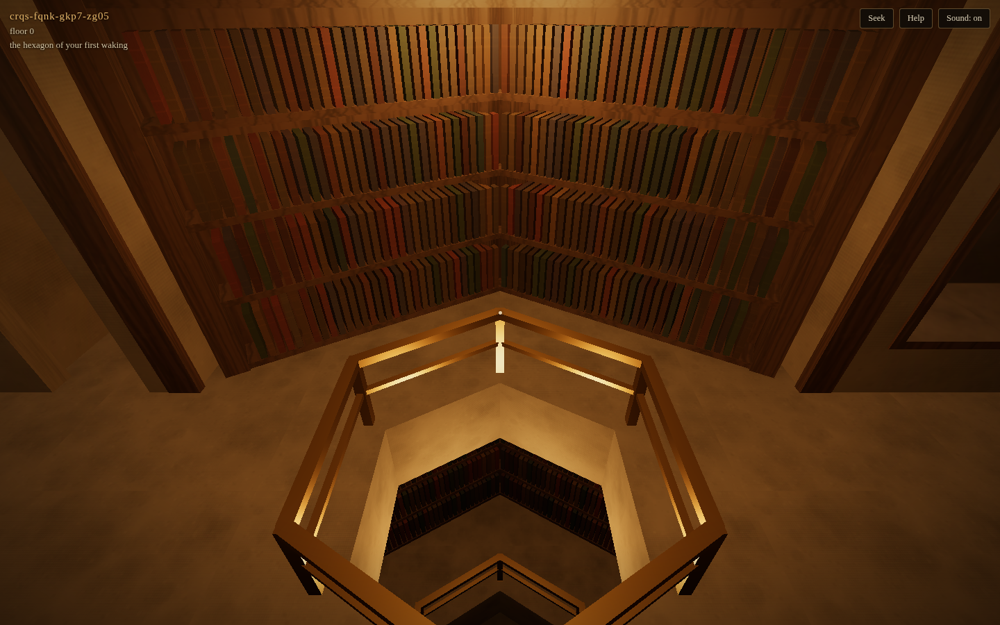
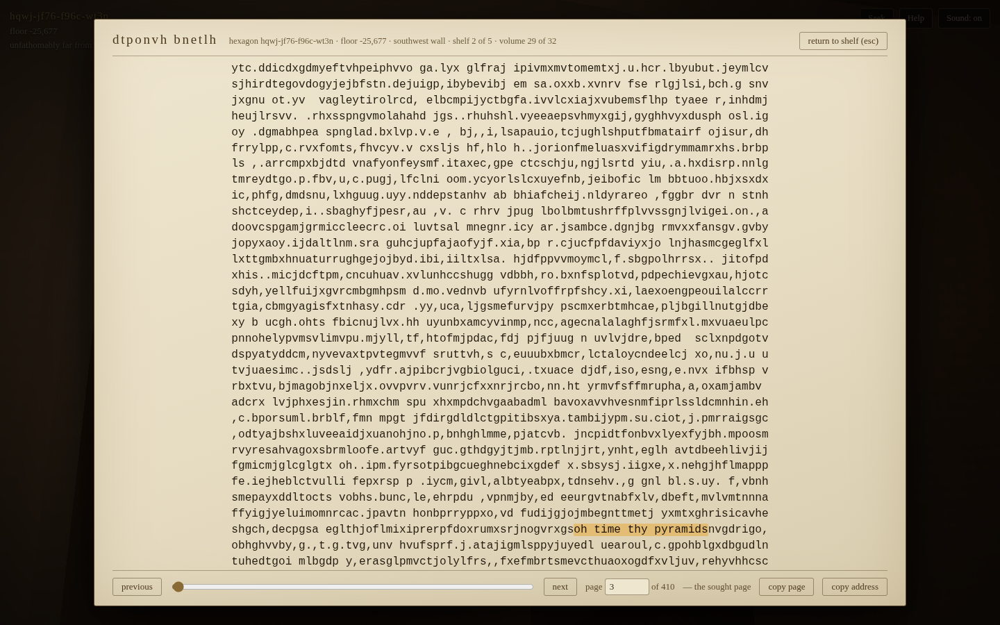

# The Library of Babel — a walkable replica

A browser-playable, first-person 3D reconstruction of the universe described
in Jorge Luis Borges's 1941 story *The Library of Babel* — not a scene
inspired by it, but the thing itself, to the letter: endless identical
hexagonal galleries, twenty shelves to a room, thirty-two books of uniform
format to a shelf, 410 pages to a book, forty lines to a page, some eighty
characters to a line, twenty-five orthographic symbols — and therefore,
somewhere among the hexagons, **every book that can possibly exist**.

You can pull any volume off any shelf and read its 410 pages. And you can
type any text and the Library will name — not generate, *name* — the exact
hexagon, wall, shelf, volume and page that has always held it, and take you
there to see what surrounds it.



## Playing

The playable build is committed at [`docs/`](docs/) — enable GitHub Pages
for this branch/folder and it serves as-is, or run it locally:

```bash
# from a checkout, either:
cd babel && npx vite preview --outDir docs   # or any static file server:
cd babel/docs && python3 -m http.server 8080
```

For development:

```bash
cd babel
npm install
npm run dev        # vite dev server
npm run verify     # 38 unit tests + build + 20-test E2E playthrough
```

**Controls** — `WASD` walk · mouse or arrow keys look · `E` take/return a
book · `F` seek a text · `Space` hop (mind the railing) · `Shift` hurry ·
`H` help · `M` sound. Keyboard-only play is fully supported. A desktop
browser with WebGL2 is expected; there is an "economy mode" toggle on the
title screen for slower machines.

Everyone wakes in the same first hexagon, `crqs-fqnk-gkp7-zg05`. The
Library does not rearrange itself: what you find will be there for everyone
else too, and a **share link** from the seek panel leads anyone to the same
volume.



## What the story specifies, and where this build obeys it

| Borges | This build |
| --- | --- |
| "an indefinite and perhaps infinite number of hexagonal galleries" | Unbounded corridors of identical hexagons, unbounded floors; see *Geometry of the whole*, below |
| "vast air shafts between, surrounded by very low railings", "From any one hexagon one can see, interminably, the upper and lower floors" | Central hexagonal shaft through every floor; 0.4 m railing; the storeys above and below are visible through it, fading into darkness |
| "the same disorder... repeated, would be an order: the Order"; "unlimited and cyclical" | The corridor coordinate is arithmetic modulo 25^1,312,000: travel far enough and the same volumes repeat in the same disorder |
| "Twenty shelves, five long shelves per side, cover all the sides except two" | Four shelved walls × five shelves = twenty; the two free sides are the vestibule doors |
| shelf height "scarcely exceeds the height of a normal librarian" | Floor-to-ceiling bookcases at 2.05 m; a claustrophobic, correct ceiling |
| "One of the free sides leads to a narrow entrance way" (zaguán) | Both free sides open onto narrow vestibules joining gallery to gallery (see *Interpretive choices*) |
| "two very small closets. In the first, one may sleep standing up; in the other, satisfy one's fecal necessities" | Two 0.66 × 0.8 m closets off each vestibule: one with a leaning-board, one with a latrine |
| "Also through here passes a spiral stairway, which sinks abysmally and soars upwards to remote distances" | A walkable helical stair in every vestibule, connecting every floor; its well runs unbroken through the slabs |
| "In the hallway there is a mirror which faithfully duplicates all appearances" | A live, real-time mirror in every vestibule (`screenshots/mirror.png`) |
| "light is provided by some spherical fruit which bear the name of lamps. There are two, transversally placed, in each hexagon. The light they emit is insufficient, incessant" | Two glowing spheres per hexagon, north and south; deliberately dim; never off |
| "each shelf contains thirty-two books of uniform format" | 32 × uniform 30 × 21.5 × 4 cm volumes per shelf, 640 per hexagon |
| "each book is of four hundred and ten pages; each page, of forty lines, each line, of some eighty letters" | 410 × 40 × 80 = 1,312,000 characters per book, exactly |
| "The orthographical symbols are twenty-five in number": twenty-two letters, the comma, the period, the space | `" abcdefghijlmnoprstuvxy,."` — see *Interpretive choices* |
| "each book is unique, irreplaceable" (but the Library is cyclical) | Within a shelf-position class, every possible book occurs exactly once per cosmic period — see *Geometry of the whole* |
| "letters on the spine of each book; these letters do not indicate or prefigure what the pages will say" | Spine titles are generated independently of contents, so they truly prefigure nothing |
| "the certitude that some shelf in some hexagon holds precious books" | Type the text into **Seek**; the shelf is computed, and it was always that shelf |
| the shaft: bodies "fall infinitely", "corruption and dissolution in the fall" | Vault the railing and you will fall past identical floors until the Library takes pity on the dreamer |

## The mathematics (how every book can exist)

A book is a string of 1,312,000 symbols over a 25-letter alphabet. A
hexagon's *identity* `h` is an integer with exactly that many base-25
digits, stored as a plain digit array — no bignum library, every operation
linear. For each of the 640 shelf positions there is a keyed **Feistel
permutation** `F_slot` over that space (4 rounds; each round hashes one
half of the digits and streams a pseudorandom digit sequence onto the other
half). Then:

```
book_on_shelf(h, slot) = F_slot(h)          — generation (≈ tens of ms)
h = F_slot⁻¹(book)                          — the seek (same cost)
```

Because `F_slot` is a bijection, **every possible 410-page book stands at
every shelf position in exactly one hexagon per period** — the Library is
total, and the same place always holds the same book, with no storage and
no server: it is all recomputed, identically, forever (the master seed is
pinned, and so are golden test values).

Space is laid out as `h = (c + K·f) mod 25^1,312,000`, where `c` is the
corridor coordinate, `f` the floor, and `K` a fixed huge constant — so the
Library is spatially unbounded yet cyclical, exactly as the narrator
suspects in the story's final footnote-adjacent lines.

**Seek** composes the target book (your text at a deterministic position,
surrounded either by uniform random symbols or by silence), inverts the
permutation, and derives the spatial address. Deterministic seeding means
the same words always name the same volume — the Library does not move
things around for your convenience; you were simply told where to look.



## Interpretive choices (where Borges is silent or ambiguous)

- **The twenty-two letters.** Borges's footnote counts 25 symbols but never
  lists the letters. We drop `k q w z` from the Latin 26 — every letter in
  the story's own specimens (`dhcmrlchtdj`, `axaxaxas mlö`, `oh time thy
  pyramids`) survives. Seek-texts are transliterated like a copying
  librarian would: `k→c, q→c, w→v, z→s`, accents stripped, digits dropped
  (with a full report in the panel).
- **One door or two.** The text says "one of the free sides leads to a
  narrow entrance way" and leaves the other free side unspecified. With a
  single door, hexagons pair off and the narrator's lifelong journeys
  (leagues of travel, born in one hexagon, dying in another) become
  impossible; we give both free sides doors, producing endless straight
  corridors — the reading nearly all reconstructions adopt.
- **Shaft placement.** "Vast air shafts between, surrounded by very low
  railings" — we put one shaft at each gallery's center, which is what lets
  you "see, interminably, the upper and lower floors" from any hexagon.
- **Exact repetition.** 25^1,312,000 is not divisible by 640, so a library
  where every book occurs exactly once cannot also fill every hexagon
  uniformly — the story's arithmetic is (knowingly or not) inconsistent.
  We keep the hexagons uniform: each possible book occurs once per period
  *per shelf-position class* (640 occurrences per period in all, each
  copies of one another at distances of ~10^1,834,090 hexagons — further
  than any librarian will walk).
- **Meters.** Borges gives no lengths beyond the librarian-height ceiling;
  the room is sized from its own constraints (32 spines of a plausible
  410-page volume per shelf, plus frames).

## Engineering notes

- **Stack**: TypeScript, three.js, vite; no frameworks, no runtime assets —
  wood, stone, leather, brass and all sounds are generated procedurally.
- **Rendering**: the whole visible Library is ~10 draw calls — one
  instanced mesh per material for all hexagons, one for all 30,000-odd
  visible books. A floating origin recenters the world every hexagon, so
  coordinates keep exact precision even 10^1,834,000 galleries from home.
- **Physics** is analytic: walls are segments, the stair is a known helix
  (its ground height is a formula, not a mesh query), the shaft is a
  bottomless hole, the railing is exactly vaultable.
- **Books** are 1.3 MB digit arrays generated on demand in ~30 ms and
  LRU-cached; shelf colors are cheap spatial hashes, so walking never
  touches the heavy math.

## Verification

- `npm test` — 38 unit tests: a Borges-fidelity suite (every number above),
  Feistel bijectivity both ways, seek round-trips (travel to the result and
  the text is there, at the reported page and offset), transliteration,
  bignum arithmetic, statistical sanity of generated books, performance
  budget, and **pinned golden values** (the first hexagon's first book
  begins `vhd g.djgbys gpurud xylphxf,s.nlvovntba.` forever; if that test
  fails, the universe has been replaced).
- `npm run test:e2e` — a 20-test end-to-end playthrough of the production
  build in headless Chromium: enter, walk to the neighbouring hexagon (its
  name is pinned), walk back, take a book off a shelf and read it, climb
  the spiral stair a floor and descend again, type a seek, verify the
  in-browser address equals the address computed independently in Node,
  travel, open the sought volume — it opens on the sought page with the
  text highlighted — re-seek reproducibly, read a blank "alone" book, vault
  the railing, fall, wake 8,191 floors down, and finish with zero page
  errors and a live WebGL context.

The E2E harness drives the simulation with a fixed timestep and renders
only for screenshots (headless compositors starve `requestAnimationFrame`,
and SwiftShader cannot render in real time), but all input is real trusted
keyboard and mouse events against the real UI.

## A few places to visit

- Seek `oh time thy pyramids` — the story's own found poem.
- Seek your name, in "alone in a blank book" mode.
- Walk east for a while. Every hexagon will offer you 640 books no one has
  ever opened, and never will again.
- Look over the railing. Then, if you must, hop it.

---

*"The Library will endure: illuminated, solitary, infinite, perfectly
motionless, equipped with precious volumes, useless, incorruptible,
secret." — J. L. Borges, tr. J. E. Irby*
